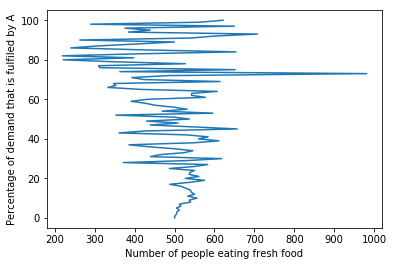

# Waste Food Management
---
Despite the overwhelming food supply, people still go hungry. This project is a way to come up with a part of the solution to a global problem.

Restaurants produce food in abundance to meet their demands. Some of this food gets wasted or thrown. We are modelling a scenario where we take the food from these restaurants and give it to the ones in need through our tie-ups. The tie-ups are organisations (NGOs) or religious places where the poor come to be served free food.

## Problem Set-up
 ---
We model this as a sequential decision modelling problem where we implement 3 policies.
The span of this problem occurs over a 12 hour day where we are the food bank in charge of allocating food resources to multiple tie-ups. Each tie-up has it's own demand ($D_t$) which we know the forecast of.

Over the 12 hour day, we send out food to one tie-up in one hour. Therefore, we have 12 tie-ups to send food out to. We have $R_0$ amount of food in our storage initially that keeps decreasing as we keep sending the food out.
Problem sequence:
1. Collect food amount $R_0$ from restaurants at night and store in food bank storage units.   
2. In the morning, the 12 hour day starts.
3. At $t=0$, allot food amount $x_t$ to the first tie-up '$t_1$'where food is distributed throughout the hour.
   (The demand is not known until the end of the hour)
4. Once the first hour is up, at $t=t+1$, send out $x_{t+1}$ to the next tie-up and so on....    

Note: Keep updating the amount of food you have in storage as $R_{t+1}$ = $R_t$ - $x_t$

But there is a catch to this problem!! You can only send out food that is **fresh**. 
To quantify freshness, we introduce a freshness factor $f_F$ where $F= A,B$
We assume there to be 2 kinds of food in the storage.
1. Type A is the kind of food that deteriorates faster with time.
2. Type B is the kind of food that deteriorates with time but at a rate that is much slower than type A.

$f_{F,t+1}$ = $f_{F,t}$ - $E_{F,t+1}$

where $E_{F,t+1}$ is a decreasing function.
The rates at which type A and B deteriorate are:

$E_{A,t+1}$ = {1,5,10} 

$E_{B,t+1}$ = {1,2,3}

The decreasing function $E_{F,t+1}$ can take on any of the 3 values with equal probability.
We start off by assuming the food in storage initially is $f_F$ = 500 for both type A and B. This value decreases as every hour passes. 

## Modelling the problem
---
*State variables*: $R_A$ , $R_B$ , $f_A$ , $f_B$

*Exogenous information*: $E_A$ , $E_B$ , $D$

*Transition function*: 

$R_{F,t+1}$ = $R_{F,t}$ - $x_{F,t}$
                       
$f_{F,t+1}$ = $f_{F,t}$ - $E_{F,t+1}$

where F = A,B
 
*Decision variables*: 

Decision 1: How much quantitiy of food to send to one tie-up? $x_t$ = ?

Decision 2: How much of it should be type A and type B? $x_{A,t}$ = ?   $x_{B,t}$ = ? 

*Constraints*: 

For F= A,B

$x_F$ <= $R_F$........*you can only send as much as you have*

$f_F$ > 0 ............*you can only serve fresh food, i.e, if freshness factor becomes 0, the food must be thrown away*


## Policy 1

**Decision 1:**
Divide the amount of food to every tie-up equally irrespective of the demand. Send the demand needed if below equal or send equal.

**Decision 2**
Type A should be 60% of the demand and type B should be 40% of demand.


```python
global fa
global fb
global x
global Ra
global Rb
global R
global T
global t
global d
import random
T=12
fa=50
fb=50
Ra=500
Rb=500
d=0
R = Ra+Rb
def demandcalc(T):
    global D
    D= random.normalvariate(100,20) #random.choice(50,100)
    equal=(R//T)  #use t as start index while T comes from the other way
    Dmu= 100
    if equal-D>=0:
        x=D
    else:
        x=equal #what if actual demand is much greater than equal
    print("The calculated demand is : %r" %x)
    return x
    

def send(x, t):
    global fa
    global fb
    global D
    global d
    global Ra
    global Rb
    global R
    fa = fa
    fb = fb
    D = D
    d = d
    Ra = Ra
    Rb = Rb
    R = R
    Eaa= [1,5,10];
    Ea= random.choice(Eaa)
    Ebb= [1,2,3];
    Eb= random.choice(Ebb)
    fa= fa - Ea
    fb= fb - Eb
    print("The freshness is : %r / %r" %(fa,fb))
    xa= int(0.6*x)
    xb= int(0.4*x)
    print("The expected amount of A and B to be sent : %r / %r" %(xa,xb))
    if fa>0:   
        if Ra>=xa:  
            Ra= Ra-xa
        else:
            d= xa-Ra #d is deficit
            xa=Ra
            Ra=0
    else: 
        Ra=0
        xa=0
        xb=x
    print("The amount of A sent: %r" %xa)
    print("The amount of A left: %r" %(Ra))
    if fb>0: 
        xb=xb+d
        d=0
        if Rb>=xb:
            Rb= Rb-xb
        else: 
            xb=Rb
            Rb=0
    else:
        Rb=0
        xb=0
    print("The amount of B sent: %r" %xb)
    print("The amount of B left: %r" %(Rb))
    x= xa+xb
    print("The total amount sent : %r" %x)
    R= Ra+Rb
    print("The Total amount left is : %r" %(R))
T = 12
Sum = 0
for i in range(1,13):
    print("For tie-up %r" %i)
    x = demandcalc(T)
    Sum = int(Sum + x)
    send(x, i)
    T = T-1
print("The total demand in all the tie-ups is %r" %Sum)
```

    For tie-up 1
    The calculated demand is : 73.76513778957445
    The freshness is : 49 / 49
    The expected amount of A and B to be sent : 44 / 29
    The amount of A sent: 44
    The amount of A left: 456
    The amount of B sent: 29
    The amount of B left: 471
    The total amount sent : 73
    The Total amount left is : 927
    For tie-up 2
    The calculated demand is : 84
    The freshness is : 39 / 48
    The expected amount of A and B to be sent : 50 / 33
    The amount of A sent: 50
    The amount of A left: 406
    The amount of B sent: 33
    The amount of B left: 438
    The total amount sent : 83
    The Total amount left is : 844
    For tie-up 3
    The calculated demand is : 84
    The freshness is : 29 / 45
    The expected amount of A and B to be sent : 50 / 33
    The amount of A sent: 50
    The amount of A left: 356
    The amount of B sent: 33
    The amount of B left: 405
    The total amount sent : 83
    The Total amount left is : 761
    For tie-up 4
    The calculated demand is : 84
    The freshness is : 19 / 43
    The expected amount of A and B to be sent : 50 / 33
    The amount of A sent: 50
    The amount of A left: 306
    The amount of B sent: 33
    The amount of B left: 372
    The total amount sent : 83
    The Total amount left is : 678
    For tie-up 5
    The calculated demand is : 84
    The freshness is : 18 / 42
    The expected amount of A and B to be sent : 50 / 33
    The amount of A sent: 50
    The amount of A left: 256
    The amount of B sent: 33
    The amount of B left: 339
    The total amount sent : 83
    The Total amount left is : 595
    For tie-up 6
    The calculated demand is : 85
    The freshness is : 17 / 41
    The expected amount of A and B to be sent : 51 / 34
    The amount of A sent: 51
    The amount of A left: 205
    The amount of B sent: 34
    The amount of B left: 305
    The total amount sent : 85
    The Total amount left is : 510
    For tie-up 7
    The calculated demand is : 72.82279477997855
    The freshness is : 16 / 39
    The expected amount of A and B to be sent : 43 / 29
    The amount of A sent: 43
    The amount of A left: 162
    The amount of B sent: 29
    The amount of B left: 276
    The total amount sent : 72
    The Total amount left is : 438
    For tie-up 8
    The calculated demand is : 78.68784005811696
    The freshness is : 6 / 37
    The expected amount of A and B to be sent : 47 / 31
    The amount of A sent: 47
    The amount of A left: 115
    The amount of B sent: 31
    The amount of B left: 245
    The total amount sent : 78
    The Total amount left is : 360
    For tie-up 9
    The calculated demand is : 90
    The freshness is : -4 / 36
    The expected amount of A and B to be sent : 54 / 36
    The amount of A sent: 0
    The amount of A left: 0
    The amount of B sent: 90
    The amount of B left: 155
    The total amount sent : 90
    The Total amount left is : 155
    For tie-up 10
    The calculated demand is : 51
    The freshness is : -5 / 35
    The expected amount of A and B to be sent : 30 / 20
    The amount of A sent: 0
    The amount of A left: 0
    The amount of B sent: 51
    The amount of B left: 104
    The total amount sent : 51
    The Total amount left is : 104
    For tie-up 11
    The calculated demand is : 52
    The freshness is : -10 / 34
    The expected amount of A and B to be sent : 31 / 20
    The amount of A sent: 0
    The amount of A left: 0
    The amount of B sent: 52
    The amount of B left: 52
    The total amount sent : 52
    The Total amount left is : 52
    For tie-up 12
    The calculated demand is : 52
    The freshness is : -15 / 32
    The expected amount of A and B to be sent : 31 / 20
    The amount of A sent: 0
    The amount of A left: 0
    The amount of B sent: 52
    The amount of B left: 0
    The total amount sent : 52
    The Total amount left is : 0
    The total demand in all the tie-ups is 889
    

## Policy 2: 

**Decision 1**:
Send whatever the forecasted demand is 

**Decision 2**: 
Send 60% A and 40% B


```python
global fa
global fb
global x
global Ra
global Rb
global R
global T
global t
global d
import random
T=12
fa=50
fb=50
Ra=500
Rb=500
d=0
R = Ra+Rb
def demandcalc(T):
    global D
    D= random.normalvariate(100,20) #random.choice(50,100)
    x=D
    print("The calculated demand is or the amount to be sent : %r" %x)
    return x

def send(x, t):
    global fa
    global fb
    global D
    global d
    global Ra
    global Rb
    global R
    fa = fa
    fb = fb
    D = D
    d = d
    Ra = Ra
    Rb = Rb
    R = R
    Eaa= [1,5,10];
    Ea= random.choice(Eaa)
    Ebb= [1,2,3];
    Eb= random.choice(Ebb)
    fa= fa - Ea
    fb= fb - Eb
    print("The freshness is : %r / %r" %(fa,fb))
    xa= int(0.6*x)
    xb= int(0.4*x)
    print("The expected amount of A and B to be sent : %r / %r" %(xa,xb))
    if fa>0:   
        if Ra>=xa:  
            Ra= Ra-xa
        else:
            d= xa-Ra #d is deficit
            xa=Ra
            Ra=0
    else: 
        Ra=0
        xa=0
        xb=x
    print("The amount of A sent: %r" %xa)
    print("The amount of A left: %r" %(Ra))
    if fb>0: 
        xb=xb+d
        d=0
        if Rb>=xb:
            Rb= Rb-xb
        else: 
            xb=Rb
            Rb=0
    else:
        Rb=0
        xb=0
    print("The amount of B sent: %r" %xb)
    print("The amount of B left: %r" %(Rb))
    x= xa+xb
    print("The total amount sent : %r" %x)
    R= Ra+Rb
    print("The Total amount left is : %r" %(R))
T = 12
Sum = 0
for i in range(1,13):
    print("For tie-up %r" %i)
    x = demandcalc(T)
    Sum = int(Sum + x)
    send(x, i)
    T = T-1
print("The total demand in all the tie-ups is %r" %Sum)
```

    For tie-up 1
    The calculated demand is or the amount to be sent : 113.47276058265248
    The freshness is : 40 / 47
    The expected amount of A and B to be sent : 68 / 45
    The amount of A sent: 68
    The amount of A left: 432
    The amount of B sent: 45
    The amount of B left: 455
    The total amount sent : 113
    The Total amount left is : 887
    For tie-up 2
    The calculated demand is or the amount to be sent : 129.50822402473636
    The freshness is : 30 / 44
    The expected amount of A and B to be sent : 77 / 51
    The amount of A sent: 77
    The amount of A left: 355
    The amount of B sent: 51
    The amount of B left: 404
    The total amount sent : 128
    The Total amount left is : 759
    For tie-up 3
    The calculated demand is or the amount to be sent : 67.29426109936557
    The freshness is : 25 / 42
    The expected amount of A and B to be sent : 40 / 26
    The amount of A sent: 40
    The amount of A left: 315
    The amount of B sent: 26
    The amount of B left: 378
    The total amount sent : 66
    The Total amount left is : 693
    For tie-up 4
    The calculated demand is or the amount to be sent : 135.8241952550827
    The freshness is : 20 / 40
    The expected amount of A and B to be sent : 81 / 54
    The amount of A sent: 81
    The amount of A left: 234
    The amount of B sent: 54
    The amount of B left: 324
    The total amount sent : 135
    The Total amount left is : 558
    For tie-up 5
    The calculated demand is or the amount to be sent : 72.108346041468
    The freshness is : 15 / 39
    The expected amount of A and B to be sent : 43 / 28
    The amount of A sent: 43
    The amount of A left: 191
    The amount of B sent: 28
    The amount of B left: 296
    The total amount sent : 71
    The Total amount left is : 487
    For tie-up 6
    The calculated demand is or the amount to be sent : 71.70163352520441
    The freshness is : 5 / 37
    The expected amount of A and B to be sent : 43 / 28
    The amount of A sent: 43
    The amount of A left: 148
    The amount of B sent: 28
    The amount of B left: 268
    The total amount sent : 71
    The Total amount left is : 416
    For tie-up 7
    The calculated demand is or the amount to be sent : 61.760037654801984
    The freshness is : -5 / 34
    The expected amount of A and B to be sent : 37 / 24
    The amount of A sent: 0
    The amount of A left: 0
    The amount of B sent: 61.760037654801984
    The amount of B left: 206.23996234519802
    The total amount sent : 61.760037654801984
    The Total amount left is : 206.23996234519802
    For tie-up 8
    The calculated demand is or the amount to be sent : 70.85288966963763
    The freshness is : -6 / 31
    The expected amount of A and B to be sent : 42 / 28
    The amount of A sent: 0
    The amount of A left: 0
    The amount of B sent: 70.85288966963763
    The amount of B left: 135.38707267556038
    The total amount sent : 70.85288966963763
    The Total amount left is : 135.38707267556038
    For tie-up 9
    The calculated demand is or the amount to be sent : 69.87171423224845
    The freshness is : -7 / 28
    The expected amount of A and B to be sent : 41 / 27
    The amount of A sent: 0
    The amount of A left: 0
    The amount of B sent: 69.87171423224845
    The amount of B left: 65.51535844331192
    The total amount sent : 69.87171423224845
    The Total amount left is : 65.51535844331192
    For tie-up 10
    The calculated demand is or the amount to be sent : 105.69993805474734
    The freshness is : -8 / 25
    The expected amount of A and B to be sent : 63 / 42
    The amount of A sent: 0
    The amount of A left: 0
    The amount of B sent: 65.51535844331192
    The amount of B left: 0
    The total amount sent : 65.51535844331192
    The Total amount left is : 0
    For tie-up 11
    The calculated demand is or the amount to be sent : 95.7307162498553
    The freshness is : -13 / 23
    The expected amount of A and B to be sent : 57 / 38
    The amount of A sent: 0
    The amount of A left: 0
    The amount of B sent: 0
    The amount of B left: 0
    The total amount sent : 0
    The Total amount left is : 0
    For tie-up 12
    The calculated demand is or the amount to be sent : 101.17679849874155
    The freshness is : -14 / 20
    The expected amount of A and B to be sent : 60 / 40
    The amount of A sent: 0
    The amount of A left: 0
    The amount of B sent: 0
    The amount of B left: 0
    The total amount sent : 0
    The Total amount left is : 0
    The total demand in all the tie-ups is 1088
    

## Policy 3: 
*Optimization over the freshness (We maximize the number of people having fresh food where fresh food is limited to a value of 35 and above)*

**Decision 1**: 
Send whatever the forecasted demand is

**Decision 2**:
Send the type A quantity as j% of demand such that maximum number of people get fresh food


```python
global fa
global fb
global x
global Ra
global Rb
global R
global T
global t
global d
global D
global aa
global bb
global ff
global s
global j
global v
global sum
import random
import matplotlib.pyplot as plt 
fa=50
fb=50
Ra=500
Rb=500
d=0
aa=0
bb=0
sum=0
s=[]
j=[]
R = Ra+Rb

for j in range(0,101,1):
    fa=50
    fb=50
    Ra=500
    Rb=500
    d=0
    aa=0
    bb=0
    for T in range(0,13):
        D=random.normalvariate(100,20) #random.choice(50,100)
        x=D
        #print("The calculated demand is or the amount to be sent : %r" %x)
        Eaa= [1,5,10];
        Ea= random.choice(Eaa)
        Ebb= [1,2,3];
        Eb= random.choice(Ebb)
        fa= fa - Ea
        fb= fb - Eb
        #print("The freshness is : %r / %r" %(fa,fb))
        xa= int((j/100)*x)
        xb= int(((100-j)/100)*x)
        #print("The expected amount of A and B to be sent : %r / %r" %(xa,xb))
        if fa>=0:   
            if Ra>=xa:  
                Ra= Ra-xa
            else:
                d= xa-Ra #d is deficit
                xa=Ra
                Ra=0
                
            if fa>=35:
                aa=aa+xa
            else:
                aa=aa
        else: 
            Ra=0
            xa=0
            xb=x
        #print("The amount of A sent: %r" %xa)
        #print("The amount of A left: %r" %(Ra))
        if fb>0: 
            xb=xb+d
            d=0
            if Rb>=xb:
                Rb= Rb-xb
            else: 
                xb=Rb
                Rb=0
            if fb>=35:
                bb=bb+xb
            else:
                bb=bb
        else:
            Rb=0
            xb=0
        #print("The amount of B sent: %r" %xb)
        #print("The amount of B left: %r" %(Rb))
        x= xa+xb
        #print("The total amount sent : %r" %x)
        R= Ra+Rb
        #print("The Total amount left is : %r" %(R))
        ff=aa+bb
    s.append(ff)
    #print("The number of people eating fresh food is:%r" %ff)
v=max(s)
print("The maximum number of people that can get fresh food is: %r" %v)
jj=s.index(v)
print("The percentage of A that should be sent for every demand is: %r"%jj)
j= range(101)
plt.plot(s,j)
plt.ylabel('Percentage of demand that is fulfiled by A')
plt.xlabel('Number of people eating fresh food')
plt.show()


```

    The maximum number of people that can get fresh food is: 981
    The percentage of A that should be sent for every demand is: 73
    





## Inferences

### Policy 1:
1. It is not a very good policy if the goal is to maximize the number of people fed.
2. Should a scenario arise, where the demand is consistently way above the equal amount that is allocated, there will be a food    deficit at the tie-ups when the we have the food at the storage.
3. There is a high possibility of food being wasted due to the freshness falling to 0 before it could get allocated.
4. The food bank has to make multiple trips to various tie-ups when it could have allocated as much as the tie-up needed and        finished the food faster. 

### Policy 2:
1. This policy is good if we want to meet the demand but there is difficulty when we go to decide the % of demand that should be    of type A and B.
2. The stock finishes up faster which also means lesser number of trips to tie-ups compared to policy 1.

### Policy 3:
1. This policy gives the optimum percent of demand that should be fulfilled by type A and thus, type B (Type B% = 100-type A %)    if the goal in mind is to maximize the amount of fresh food consumed. 
